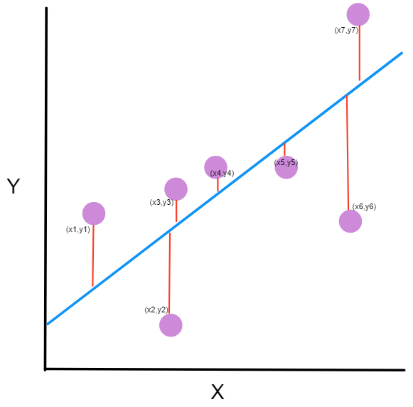

# Introduction

Almost every ML practitioner or Data Scientist would have done first opted the Linear Regression model for a structred tabular dataset. The reason being this model provides a baseline metric to compare with other models. And most of the time it is this simple models which far outperforms Boosting based models too. At some point who do analysis in python would have definetly written the following lines of code:

```python
from sklearn.linear_model import LinearRegression

model = LinearRegression()
model.fit(X_train, y_train)
```

So what the above basically does you import the class which has the Regression module and methods associated with it and instantiate the class with a variable called model. And call the fit method on the variables X_train and y_train.

In most of the cases X is your training data and y would be your labels or actual value.
Now X can just be a single column of data or X can also be a matrix. This leads to the definition of types of Linear Regression.

- If X is just single column we call it **Simple Linear Regression**.
- If X is a matrix we call it **Multiple Linear Regression**.

The idea of this article is not to demonstrate the application of Regression but to understand what happens behind the scenes of it, which gives us those predicted values, when we run the command:
```python
model.predict(X_test)
```

## Model Definition

- ### Simple Linear Regression:

Let us take an simple example of a single column dataset ie: let $X = [1.1, 1.3, 2.2, 3.7, 5.1]$ and $y = [39343, 46205, 39891, 57189, 66029]$ this dataset represents years of experience on the X coordinate and salary in the y coordinate. for sake of understanding it is written as a row, but the transpose of X and y would be the actual size, so the X matrix would have dimesion (5, 1) and y matrix would have dimension (5, 1) after transpose, which means for a matrix M of size (m, n). 
- m is the no of rows in the matrix.
- n is the no of columns in the matrix.

So the goal here is going to be to fit a line on this data. 

Let us start from the equation of a straight line from cartesian geometry: $y = mx + c$ 
- y is the value to find or dependent variable
- x is the independent variable or covariate
- m is the slope 
- c is the intercept

So now the goal is to calculate the values of m and c to find the best fit line for this particular set of points.

- **Regression Equation**
$$
y = \beta_0 + \beta_1X + \epsilon
$$

The above equation is the standard linear regression equation where $\beta_0$ is the intercept and $\beta_1$ is the slope and $\epsilon$ is the error term in the model. The error is assumed to have a normal distribution.

So the predicted value would be $\hat{y} = \hat{\beta}_0 + \hat{\beta}_1x$

- So now the main question that arises in our head:
**How do we solve to get the coefficient values of $\beta_0$ and $\beta_1$?**

- The answer lies in one simple term called RSS. Now what is that?
It's called the Residual Sum Square. Now the other question is why is it useful? 

- The main thing to understand in regression, is that it never tried to find the true function but tries to minimize a cost function that gives you the best line close to your actual function. And this is exactly what RSS does:
 
$$
RSS = \sum_{i=1}^{n} (y_i - \hat{y}_i)^2
$$

- Here $y_i$ is your actual value and $\hat{y}_i$ is your predicted value the sum of squares across all the points in the dataset must be minimum, at that point you have your best fit line for that data.



- The above diagram depicts how RSS is calculated the sum of square of those residuals across the all data points is taken and the line is moved till the least value of RSS is obtained.

### Derivation of $\beta_0$ and $\beta_1$:

$$
\sum_{i=1}^{n} (y_i - \hat{y}_i)^2 = \sum_{i=1}^{n} (y_i - (\hat{\beta}_0 + \hat{\beta}_1 x_i))^2
$$

- To solve for $\beta_0$ and $\beta_1$ we need take partial derivatives with respect to $\beta_0$ and $\beta_1$ and set them to 0.
- Solving those two equations would give you the value for it.

**Partial dertivate with respect to $\beta_0$:**
$$
\frac{\partial}{\partial \beta_0}
\sum_{i=1}^{n} \left(y_i - (\beta_0 + \beta_1 x_i)\right)^2
=
-2 \sum_{i=1}^{n} \left(y_i - (\beta_0 + \beta_1 x_i)\right)
$$

**Partial dertivate with respect to $\beta_1$:**
$$
\frac{\partial}{\partial \beta_1}
\sum_{i=1}^{n} \left(y_i - (\beta_0 + \beta_1 x_i)\right)^2
=
-2 \sum_{i=1}^{n} x_i \left(y_i - (\beta_0 + \beta_1 x_i)\right)
$$

- Setting the equations to 0 and solving them:
$$
\sum_{i=1}^{n} \left(y_i - (\beta_0 + \beta_1 x_i)\right) = 0
$$ 
$$
\sum_{i=1}^{n} x_i \left(y_i - (\beta_0 + \beta_1 x_i)\right) = 0
$$ 
- Solving for $\beta_0$:
$$
\sum_{i=1}^{n} \left(y_i - \beta_0 - \beta_1 x_i\right) = 0
$$

- Expanding the summation brackets gives us:
$$
\sum_{i=1}^{n} y_i
-
\sum_{i=1}^{n} \beta_0
-
\sum_{i=1}^{n} \beta_1 x_i
=
0
$$

$$
\sum_{i=1}^{n} y_i
-
\beta_0 \sum_{i=1}^{n} 1
-
\beta_1 \sum_{i=1}^{n} x_i
=
0
$$

$$
\sum_{i=1}^{n} y_i
-
n \beta_0
-
\beta_1 \sum_{i=1}^{n} x_i
=
0
$$

$$
n \beta_0
=
\sum_{i=1}^{n} y_i
-
\beta_1 \sum_{i=1}^{n} x_i
$$

$$
\beta_0
=
\frac{1}{n}
\sum_{i=1}^{n} y_i
-
\beta_1
\frac{1}{n}
\sum_{i=1}^{n} x_i
$$

- We know that, sum of observations divided by the total observations, gives us the mean, ie:
$$
\bar{y} = \frac{1}{n} \sum_{i=1}^{n} y_i,
\qquad
\bar{x} = \frac{1}{n} \sum_{i=1}^{n} x_i
$$

- Therefore, on substituting the mean values in the equation now gives us the quantity of $\beta_0$ ie:

$$
\beta_0 = \bar{y} - \beta_1 \bar{x}
$$

- To solve for $\beta_1$, substitute the $\beta_0$ in the equation:
$$
\sum_{i=1}^{n} x_i \left(y_i - (\beta_0 + \beta_1 x_i)\right) = 0
$$ 

- That gives us:
$$
\sum_{i=1}^{n} x_i
\left(
y_i
-
\left(
(\bar{y} - \beta_1 \bar{x}) + \beta_1 x_i
\right)
\right)
= 0
$$

- Expanding the brackets results in:
$$
\sum_{i=1}^{n} x_i
\left(
y_i
-
\bar{y}
+
\beta_1 \bar{x}
-
\beta_1 x_i
\right)
= 0
$$

- Multiplying $x_i$ with the terms gives:
$$
\sum_{i=1}^{n}
\left[
x_i (y_i - \bar{y})
+
\beta_1 x_i \bar{x}
-
\beta_1 x_i^2
\right]
= 0
$$

- Expanding the summation bracket and from the definition of mean of $x$ we get:
$$
\sum_{i=1}^{n} x_i (y_i - \bar{y})
+
\beta_1 n \bar{x}^2
-
\beta_1 \sum_{i=1}^{n} x_i^2
=
0
$$
- Taking $\beta_1$ common we can write the expression as:
$$
\sum_{i=1}^{n} x_i (y_i - \bar{y})
+
\beta_1
\left(
n \bar{x}^2
-
\sum_{i=1}^{n} x_i^2
\right)
=
0
$$

$$
\beta_1
\left(
n \bar{x}^2
-
\sum_{i=1}^{n} x_i^2
\right)
=
-
\sum_{i=1}^{n} x_i (y_i - \bar{y})
$$

- Multiply (-) on both sides we get:
$$
\beta_1
\left(
\sum_{i=1}^{n} x_i^2
-
n \bar{x}^2
\right)
=
\sum_{i=1}^{n} x_i (y_i - \bar{y})
$$

- Therefore, the value of $\beta_1$ comes down as:
$$
\beta_1
=
\frac{
\sum_{i=1}^{n} x_i (y_i - \bar{y})
}{
\sum_{i=1}^{n} x_i^2
-
n \bar{x}^2
}
$$

- From algebra definition we know that,
$$
\sum_{i=1}^{n} x_i (y_i - \bar{y})
=
\sum_{i=1}^{n} (x_i - \bar{x})(y_i - \bar{y})
$$

$$
\sum_{i=1}^{n} x_i^2 - n \bar{x}^2
=
\sum_{i=1}^{n} (x_i - \bar{x})^2
$$

- Subsituting these two results the final value of $\beta_1$ is:
$$
\beta_1
=
\frac{
\sum_{i=1}^{n} (x_i - \bar{x})(y_i - \bar{y})
}{
\sum_{i=1}^{n} (x_i - \bar{x})^2
}
$$

## Conclusion:

- So now we know the values of $\beta_0$ and $\beta_1$, using this formula, we can compute the values of the slope and intercept and plugging the values to this equation: 
$$
y = \beta_0 + \beta_1X + \epsilon
$$

would give us the final simple linear regression equation.
And this is exactly what happen behind the scenes of:
```python
model.fit(X, y)
```
this computes your $\beta_0$ and $\beta_1$ values, so when you run predict method now you just have to plug in the X_test values and you get your predicted y_test values.
- But is this all to it?
Well not exactly my friend! This is just for one column covariate, soon I will share what happens if there are multiple features or covariates which comes under multiple linear regression.

## Final Remarks:

- **Regression Analysis**: in itself is a very broad and a vast topic, the more you can go in depth into it, more the models make sense to you as to why your predictions are the way they are.

- The results here are explainable, which makes it's results more intutive and understandable, but we can't say the same thing about deep learning models now can we?
- Thanks for reading this blog :), hope it was informative. I will come up with more such blogs in the upcoming days!!